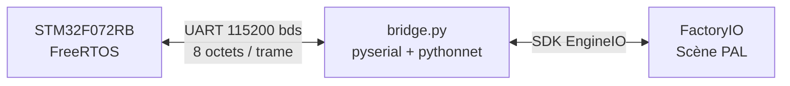
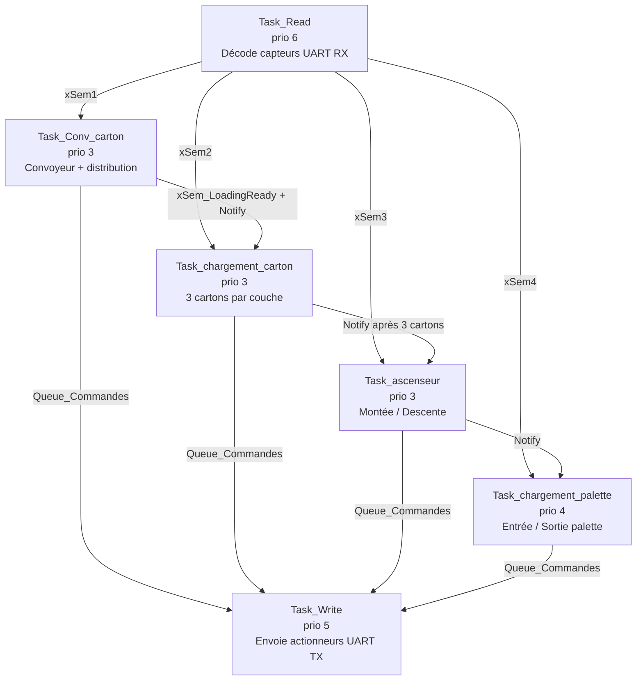
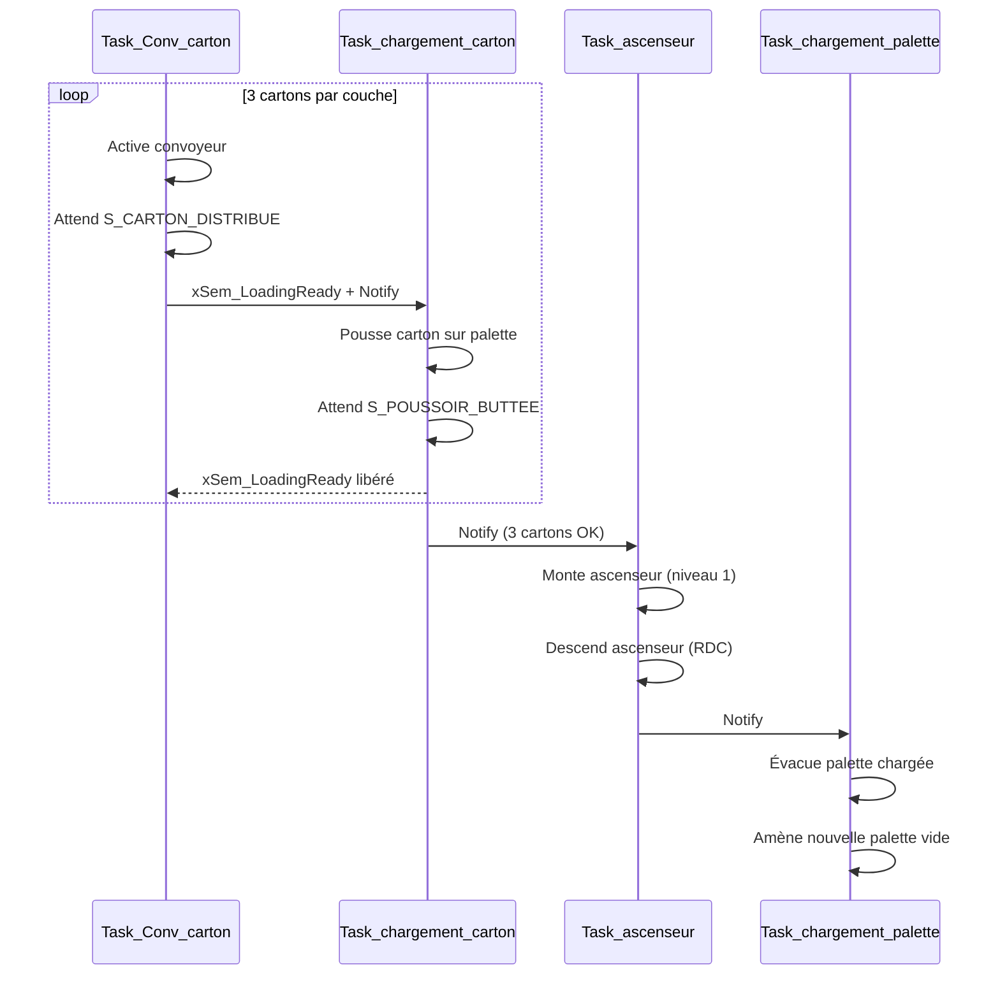

#  STM32 PAL — Factory avec FreeRTOS

> Système de palettisation automatisée piloté par un STM32F072 avec FreeRTOS, communiquant avec FactoryIO via UART/DMA.

**Polytech Montpellier | Tom Penfornis | SE 2024-2027**

---

## 📋 Présentation

Ce projet implémente le contrôle d'une ligne de palettisation simulée dans **FactoryIO**, depuis une carte **STM32F072RB**. La communication entre la carte et le PC passe par un lien **UART série** (115200 bauds) via un script Python (`bridge.py`) utilisant pyserial et pythonnet.


---

##  Protocole de Communication

Les trames UART font **8 octets** au format suivant :

| Octet | Contenu                                         |
|-------|-------------------------------------------------|
| 0     | SOF (`0xA3` Force Update / `0xA8` Sensors / `0xAD` Actuators) |
| 1–4   | Data bytes (états capteurs ou actionneurs)      |
| 5     | CRC (nombre de bits à `1` dans les data)        |
| 6     | Line Feed `\n`                                  |

Les signaux sont encodés en **LSB→MSB** sur 4 octets, permettant d'adresser jusqu'à **28 capteurs/actionneurs**.

---

##  Architecture FreeRTOS

Le système utilise **6 tâches FreeRTOS** synchronisées par sémaphores et files de messages.


### Tâches

| Tâche                      | Priorité | Rôle                                           |
|----------------------------|----------|------------------------------------------------|
| `Task_Write`               | 5        | Envoi des commandes actionneurs via UART DMA   |
| `Task_Read`                | 6        | Réception et décodage des capteurs via DMA     |
| `Task_Conv_carton`         | 3        | Gestion du convoyeur et distribution cartons   |
| `Task_chargement_carton`   | 3        | Chargement des cartons (3 par couche)          |
| `Task_ascenseur`           | 3        | Montée/descente entre les niveaux              |
| `Task_chargement_palette`  | 4        | Gestion entrée/sortie des palettes             |

### Sémaphores

| Sémaphore             | Rôle                                            |
|-----------------------|-------------------------------------------------|
| `xSem1`               | Capteurs convoyeur                              |
| `xSem2`               | Capteur poussoir                                |
| `xSem3`               | Capteurs ascenseur                              |
| `xSem4`               | Capteurs palette                                |
| `xSem_LoadingReady`   | Jeton d'accès au chargeur (1 carton à la fois)  |
| `xSemStartStop`       | Démarrage/arrêt du système                      |

---

## 🔄 Séquence de Palettisation


---

## 📁 Structure du Repo
```
STM32-PAL-FreeRTOS/
├── app/
│   ├── inc/
│   │   ├── main.h              # Types et déclarations globales
│   │   ├── FreeRTOSConfig.h    # Configuration FreeRTOS
│   │   └── stm32f0xx_it.h      # Handlers d'interruptions
│   └── src/
│       ├── main.c              # Point d'entrée + tâches FreeRTOS
│       ├── printf-stdarg.c     # Printf custom
│       └── stm32f0xx_it.c      # Interruptions DMA/UART
├── bsp/
│   ├── inc/
│   │   ├── bsp.h               # Board Support Package
│   │   ├── factory_io.h        # Interface FactoryIO (protocole UART)
│   │   └── delay.h             # Fonctions de délai
│   └── src/
│       ├── bsp.c               # Init LED, bouton, console
│       ├── factory_io.c        # Encodage/décodage trames UART
│       └── delay.c             # Implémentation délais
├── FreeRTOS/                   # Kernel FreeRTOS
├── cmsis/                      # CMSIS + drivers STM32F0xx
├── TraceRecorder/              # Percepio Tracealyzer
├── Debug_STM32F072RB_FLASH.ld  # Script linker
└── README.md
```

---

## Utilisation

### Prérequis

- **STM32CubeIDE** v1.18+
- Carte **STM32F072RB Nucleo**
- **FactoryIO** avec la scène PAL
- **Python 3** avec `pyserial` et `pythonnet`

### 1. Compiler et flasher
```
STM32CubeIDE → Build Project → Run (ou Debug)
```

### 2. Lancer le bridge Python
```bash
pip install pyserial pythonnet
python bridge.py
```

### 3. Lancer FactoryIO

Ouvrir la scène PAL dans FactoryIO et démarrer la simulation.

---

## 👤 Auteur

**Tom Penfornis** — Polytech Montpellier  
SE 2024-2027

---

## 🎬 Démonstration

https://github.com/user-attachments/assets/634019d8-b187-4560-9aa4-4dbb82d54fb9
